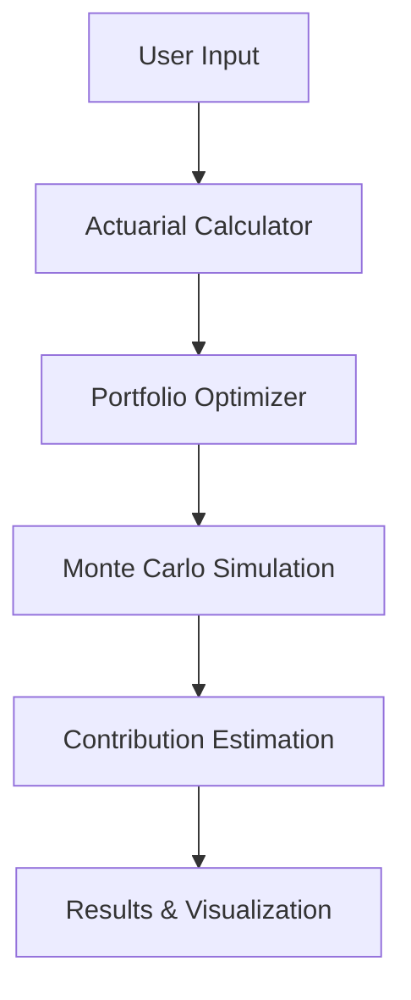

# Modelo Integrado de Cálculo Actuarial y Optimización de Carteras para la Planificación de la Jubilación


This project is a practical simulation tool developed by Matheus Holanda Maia. It integrates actuarial modeling with investment portfolio optimization to answer a key financial planning question:

> What periodic contributions are needed in an investment portfolio to reach the actuarial reserve required at retirement?

Unlike traditional approaches that separately analyze pension sufficiency or investment returns, this project combines both perspectives into a unified framework. The actuarial reserve becomes the financial target, and the investment strategy is optimized to achieve it.

---

## 🎯 Key Features


- Financial data retrieval via Yahoo Finance
- Time series modeling using ARIMA and GARCH
- Interactive visualizations with Plotly
- Portfolio optimization with PyPortfolioOpt
- Actuarial modeling using pyliferisk
- User-friendly interface built with Streamlit

---

## 🔍 Data Sources

- Mortality Tables: United Nations (World Population Prospects, 2016–2023)
- Financial Data: Yahoo Finance API (stocks, ETFs, indices)
---

## Technologies and Libraries Used

- Language: Python
- Core Libraries:
- Data Manipulation & Analysis: pandas, numpy
- Visualization: plotly (including plotly.express and plotly.graph_objects), seaborn, matplotlib
- User Interface: streamlit
- Statistical & Time Series Modeling: statsmodels (ARIMA), arch (GARCH)
- Evaluation Metrics: sklearn.metrics (MAPE)
- Portfolio Optimization: PyPortfolioOpt
- Actuarial Modeling: pyliferisk

---

## 📂 Repository Structure

```
├── app/                # Streamlit application code
├── data/               # Input data (mortality tables, etc.)
├── notebooks/          # Exploratory analysis and tests
├── requirements.txt    # Project dependencies
└── README.md           # This file
```

---

## 🚀 How to Run the Project

1. Clone the repository:
   ```bash
   git clone https://github.com/HolandaMaia/TFM.git
   cd TFM
   ```
2. Install dependencies:
   ```bash
   pip install -r requirements.txt
   ```
3. Run the application:
   ```bash
   streamlit run app/main.py
   ```

---

## 📈 Workflow Diagram



---

## ⚠️ Disclaimer

This project is for **educational and simulation purposes only**. It does not constitute financial advice and should not be interpreted as an investment recommendation.

---

## 📜 License

This project is licensed under the MIT License. See the [LICENSE](LICENSE) file for details.
